**|是什么让我下定决心投稿
**
2016，折腾了挺多东西，挺多是我能够说出来的对于过去一年的总结词汇，但是我想表达的却并不只有这个词而已。我能够用思维导图把每一阶段的关键点记录下来，但是却不能连贯而有条理地把这些表述出来，而事实上这一年来自己确实在高效效率，自我管理这些方面思考过，尝试过并且收到一定的成效。写这篇文章的目的一方面是对抗内心‘写这个好难好麻烦’的想法，另一方面也希望能够总结出一些东西并分享出来。

**|自我介绍
**
我是一名web前端开发工程师，15年毕业，目前就职于深圳一家创业公司，主要工作是HTML5游戏开发。2016年初的时候加入现在的公司，公司使用的开发工具统一是imac， 自己随后便入手了12寸macbook(主要考虑便携)，至此大学时期梦想的三件套（iphone(6)、mac(book 12)、 ipad(mini 4))终于集齐了。由于所以对于工具的使用都会考虑跨平台，易同步。关于mac的使用技巧大部分是在少数派中学习到的，所以下面的附上的一些教程链接比较多来自这里。

分享内容围绕构建知识体系中【信息获取-整理记录-同步备份】这几个部分，对于涉及到的工具更多是自己的使用以及对于我自身的影响而不会过多描述工具本身。（前方多图预警）！！！

**|获取&收集**

* **信息订阅-**Rss

 Rss(简易信息聚合)是一种描述和同步网站内容的格式。可以认为这是一种个性化订阅的服务，类似于微信订阅公众号。
 因为平时有许多信息网站或者技术博客需要关注，要一个一个去浏览既费时又容易受无关信息干扰，使用rss订阅的好处就是能够让信息主动推送，订阅之后可以直接通过列表查看网站的最新信息，通过标题决定是否继续阅读详细内容，从而大大缩减了在一些无意义的资讯或者广告中浪费时间的瞎逛，做到有目的，有限制地获取自己想要的信息。
 Rss阅读器用的是比较出名的 [Reeder](http://reederapp.com/) ，主要是操作便捷流畅，排版舒服，并且在ios上的体验也非常好。

 对于不支持rss的网站可以通过[Feed43，将任意网页制作成 RSS 订阅源](http://sspai.com/34320)

 自己有比较多记录下的必要而又不紧急的需求都是通过关注订阅的rss解决的，而不用刻意花时间去搜寻解决办法。

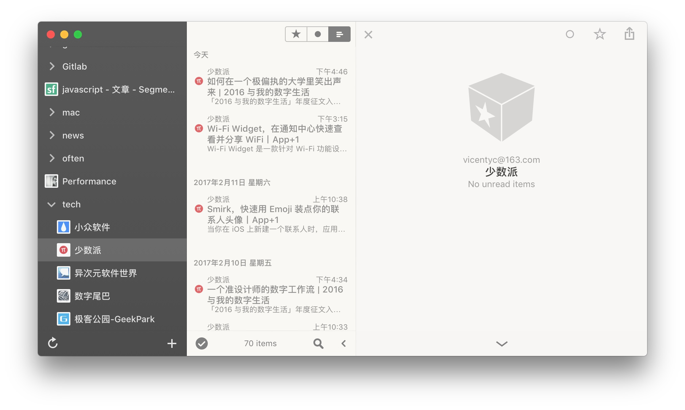

* **想法收集 备忘录和提醒事项**

 对于想法的记录需求就是要随时随地能记—即跨平台和快速同步。

 Todolist类型的软件尝试过挺多（例如AnyDo，wunderlist等），都因为记录不便捷或无法跨平台等放弃了。最后发现系统自带的这两个就已经能够满足日常的记录需求了，而且使用icloud同步能够实现在设备间无缝切换，重装系统或新添设备都能够快速恢复。在mac端可以结合Alfred（下面将提到）实现快速添加，在ios端也有更加便捷的编辑工具 [Remind Me](http://sspai.com/34510)

**|整理&记录**

* **[Mindnode](https://mindnode.com/)**

 通过思维导图在思考初期把产生的每一个想法都记录下来，非常有利于整理思维大纲，并且能够激发联想，发散思维。当完成一份思维导图后再从一个整体去看的时候，会发现原来自己已经有了这么多的想法，这是直接一条条记录所达不到的效果。文件可以通过

 工具使用的是Mindnode，它支持Mac和ios，并且可以通过icloud同步文档。操作也是非常顺畅。平常主要用思维导图梳理想法大纲（例如本篇文章）、整理知识体系、读书笔记和阶段总结，有时候也会记录头脑风暴。尤其在整理专业知识体系时候，能够更全面地理清各个点之间的关系，并且能够记录目前技术到了哪一个阶段。

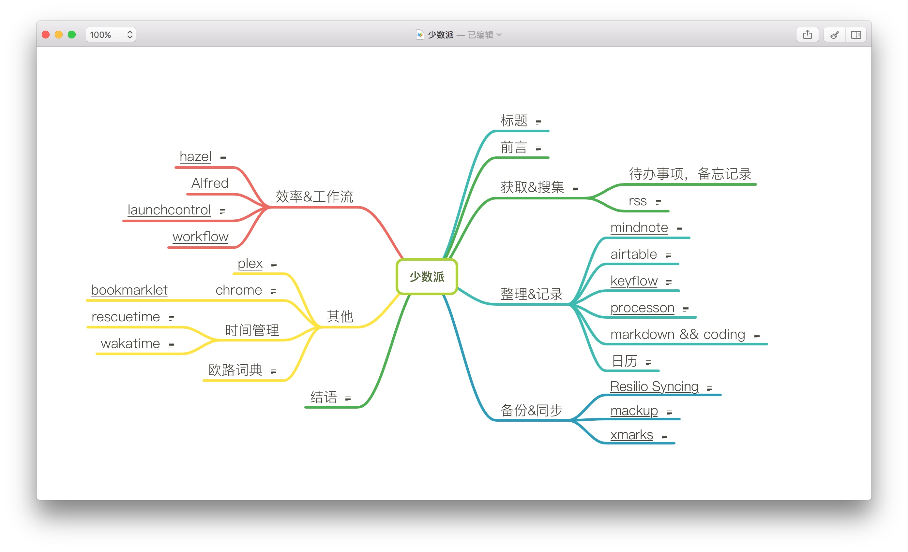

* **[Airtable](https://airtable.com/)**

 Airtable是一款在线表格工具，同时支持ios客户端。

 一直对于数据表格的编辑，查看和保存都比较头疼，直到发现了Airtable（推荐：[重新想像 Excel 该有的样子](http://sspai.com/36402)），终于实现跨平台，易编辑，在线保存文档的需求。在线版表格便于分享并且还能够团队协作。目前主要用来记录一些快捷键，跟进工作中的项目情况，之后又发现了和[workflow的结合使用用来记录书单和影单](http://sspai.com/36100)，正准备把我的app单和资源清单备份通过api调用的方式备份到这里，缺点是网络有一定限制，没有vpn打开会比较慢。

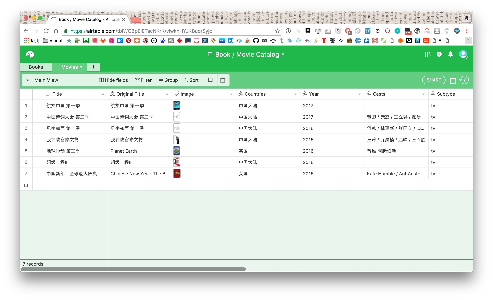

* **管理媒体文件-[Keyflow](http://www.keyflowpro.com/) **

 keyflow 是mac下一款强大的媒体文件管理工具。

 使用它管理问件相较与直接用文件夹更直观，更易于管理，并且能够更好地为文件添加标签添加备注，便于查找
 目前主要用于归类管理平时收藏的视频短片，照片，音乐。

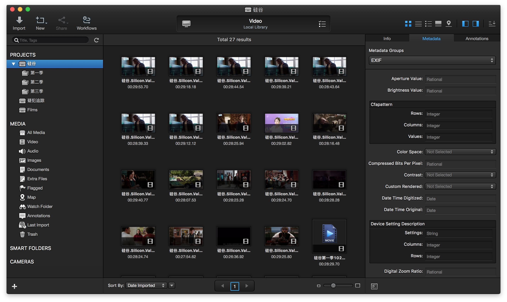

* **梳理逻辑关系-[Processon](https://www.processon.com/) **

 Process是一款在线的流程工具，除了思维导图的功能外还可以制作原型图和UML，

 之前提到的mindnode主要用于记录个人相关，而用processon记录工作相关，主要用做梳理工作项目的流程，可以云存储文件，在线编辑，也便于共享、演示。

 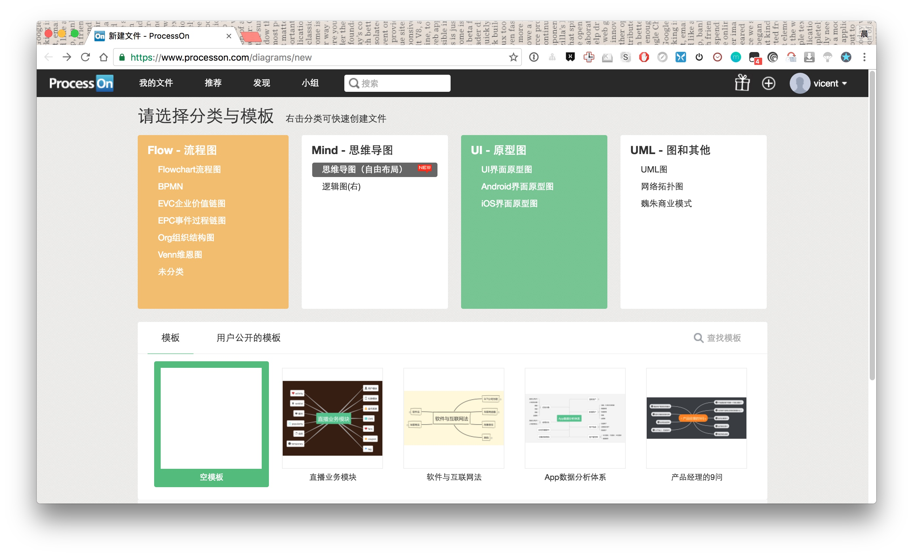

* **Markdown & git 实现笔记系统**

 记录笔记尝试过使用印象笔记和为知笔记，但是后来都无法实现最快记录，最快查找的原则而放弃了。因为笔记记录的内容与技术相关且主要文字为主，多在电脑端查看，所以最终选择了直接采用markdown格式，在代码编辑器里编写，再把整个笔记当成一个工程，通过RS同步工具进行多端同步，推送到git仓库进行备份并且还能实现版本管理。这样在工作中能以最快的速度查看到笔记内容也能更快记录。

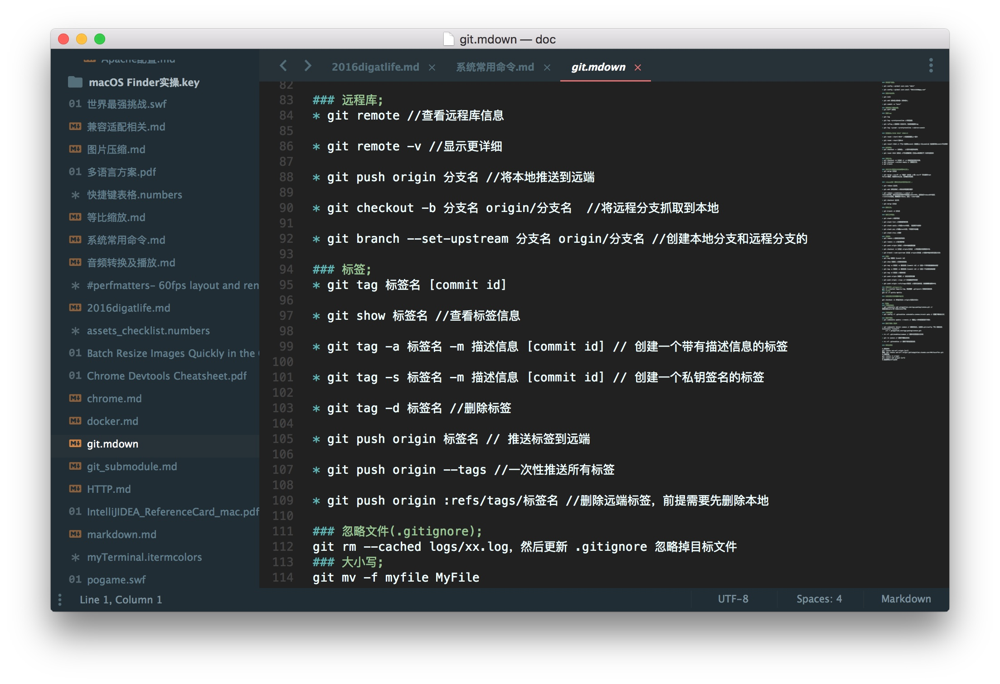

**|备份&同步**

* **文件同步-**[Resilio Syncing](https://www.resilio.com/individuals/)

 Resilio Syncing 是一款同步工具，它最大的特点是不需要将文件上传至云端服务器而是采取p2p的形式，并且不限速，不限大小。

 主要在公司电脑和自己电脑之间同步个人资料，目前云端还是用百度云，但是基本不敢再继续同步了上去了，毕竟是受过网盘伤害的孩子。后续准备先把资料备份在移动硬盘，考虑搭个Nas（我也是最近才了解到）。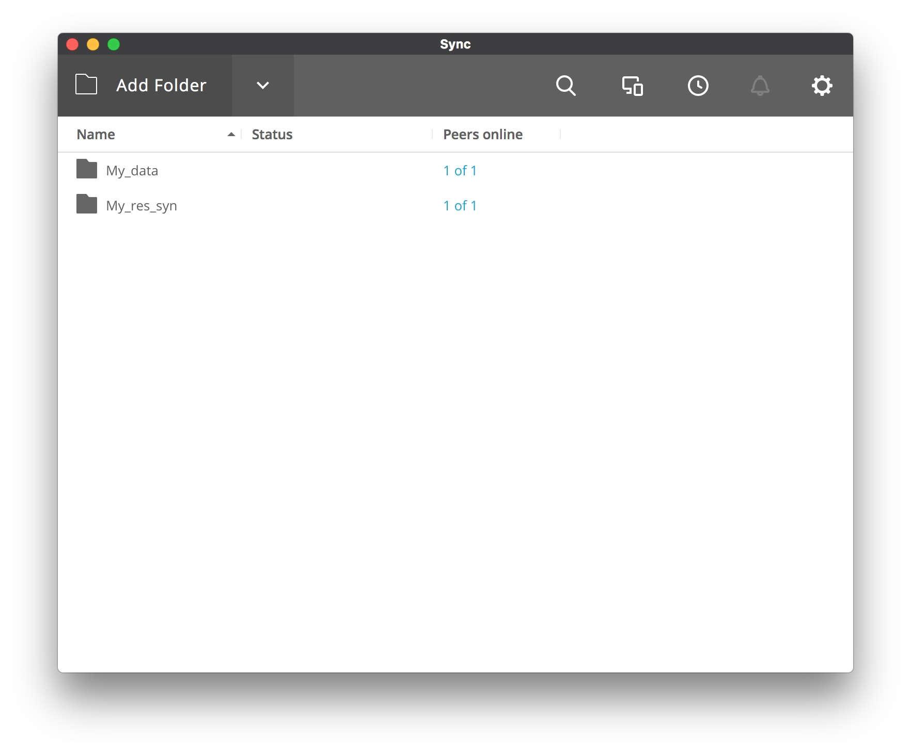** **

* **环境配置同步-Mackup**

 Mackup 是 Github 上的一个开源项目，旨在帮助你快速方便地备份恢复软件的配置文件，Mackup 已经支持了常用的软件程序。教程看这里：[使用 Mackup 快速备份 Mac 软件的配置文件](http://sspai.com/32933)

 经常在工作电脑中要对开发工具，开发环境进行配置，快捷键设置，为了一次修改能够在其他设备中生效。**
**

* **书签同步-[Xmarks](https://www.xmarks.com/) **

 日常使用的主流浏览器是chrome，由于网络限制，书签总是不能及时同步，尝试过将书签文件单独使用RS同步，依然不能解决。

 Xmarks是一款书签同步插件，支持chrome，safari，目前使用没有什么问题，只是chrome插件还是要在vpn环境下才能准确同步。

**|效率&工作流**

* **减少重复的工作-[Hazel](https://www.noodlesoft.com/)**

 Hazel 是mac下一款强大的自动化工具，关于它的基本使用推荐[Hazel，自动整理文件，让你的 Mac 井井有条](http://sspai.com/35225)

 平时如果一件事情重复到做了三遍的时候就应该意识到不能用手来完成这件事，比如平时经常重复去做的：下载一个压缩包 -\>下载完成之后打开对应文件夹 -\>手动点击解压-\>等待解压完成-\>删除源文件，每一次手动操作都要耗费许多时间，这种情况就应该考虑将部分工作交给电脑去处理。

 通过Hazel通过特定的设置就能做到只需要点击下载，然后后面的流程就能够自动处理。现在我只要下载了一本电子书就能够自动转换成目标格式，然后归档到文件系统中，删除源文件并更新书单。

 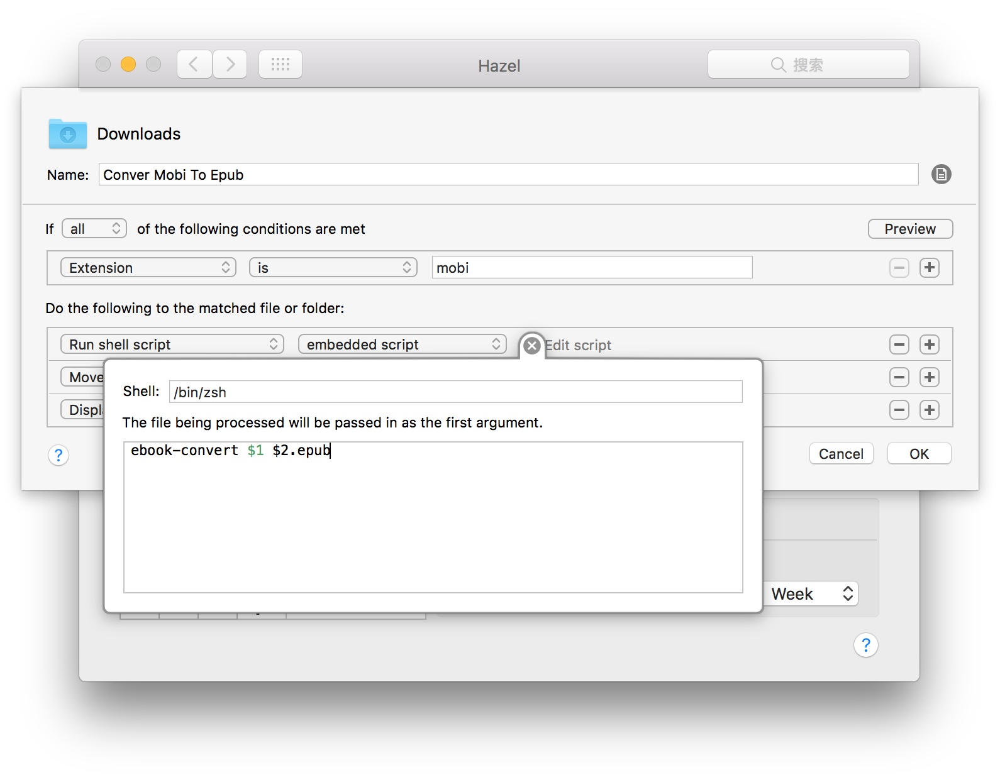

* **[Alfred](https://www.alfredapp.com/) **

 Alfred可以说是mac下神器榜之首。除了可以作为mac的入口之外，其powerpack功能允许用户编写脚本，从而提供了无限的可能。基础教程可参考 [从零开始学习 Alfred](http://sspai.com/32979)。而更高级的功能则需要学习一些编程知识，也是为了实现自己的需求去接触了一些新的脚本语言。

 主要是用来快速访问特定的文件夹，快速添加待办事项和查找文档。通过编写特定的工作流，让开发过程更加便捷。

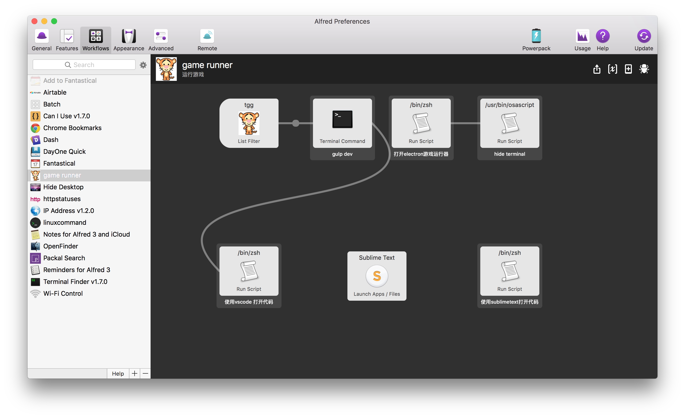
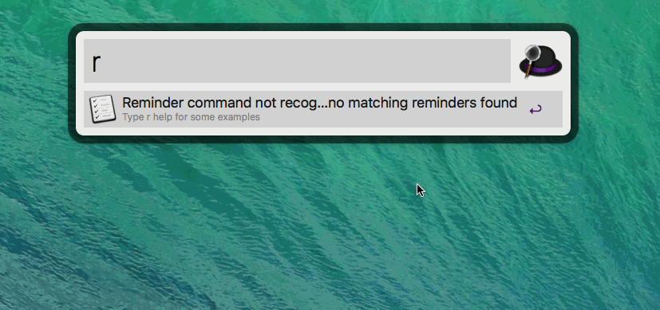

* **[LaunchControl](http://www.soma-zone.com/LaunchControl/) **

 源自于工作中有超过十个项目需要更新，如果更新文件较大，耗费的时间也较长，于是自己写一个批量更新的脚本，转换成可执行命令，再结合这个软件的定时运行功能，就可以在每天上班之前更新完全部的项目，只需要发现错误时到对应的日志文件查找即可。对于存放自己练习项目的git仓库，多写了一份每天下班之后自动推送远程仓库的功能，实现了说走就走的下班。

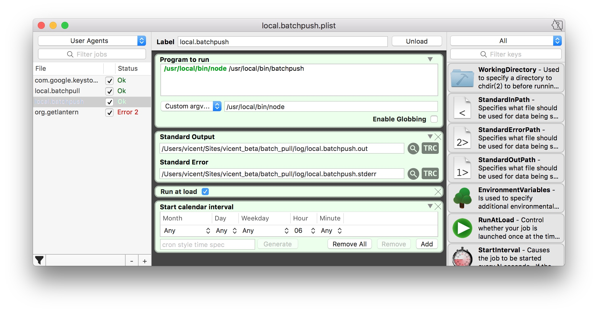

* **[Workflow](https://workflow.is/) **

 workflow 是ios上一款效率工作流软件，关于它的使用方式和各种奇巧淫技在少数派中有许多介绍。目前较多用来添加书单同步到airtable，正在进一步挖掘自身的需求。

**|其他**

* **Chrome**

 chrome是作为前端开发的主力工具，其丰富的插件也让浏览器增添了不少有趣的功能，但是chrome本身消耗资源就较高，开多了插件会造成浏览器更加卡顿

 所以需要随时开关插件的插件[Extention Manager](https://chrome.google.com/webstore/detail/gjldcdngmdknpinoemndlidpcabkggco)

    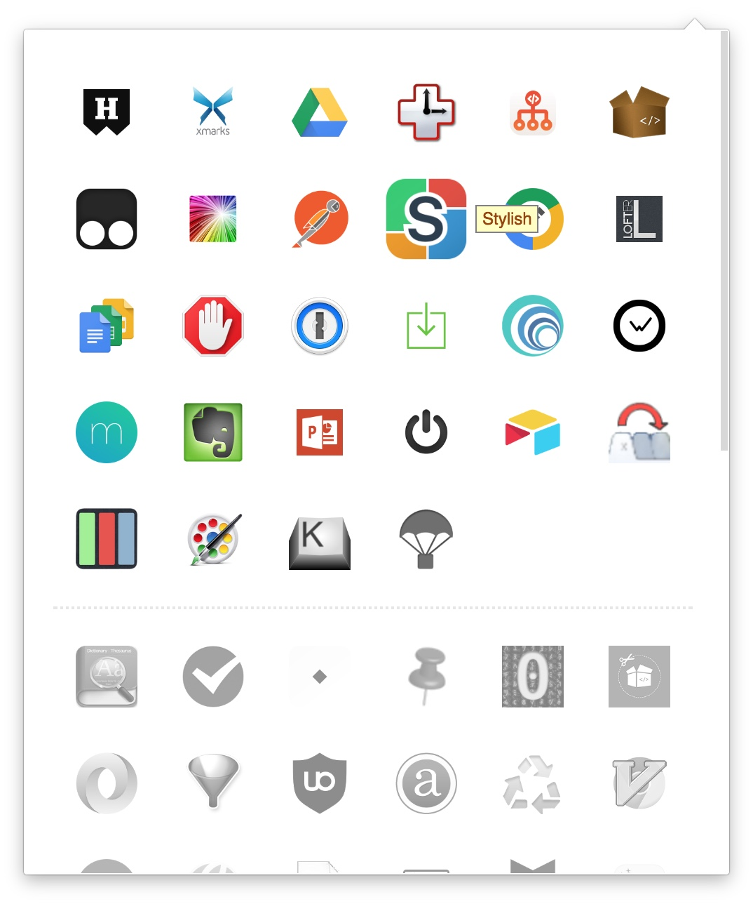

  插件神器 [tampermonkey](http://tampermonkey.net/) ，是一款通过向页面插入脚本达到特定功能的插件，允许想页面中插入脚本实现特定的功能，除了会在在论坛中找到一些想要的之外，还会自己写一些简单的脚本帮助日常的开发工作。

    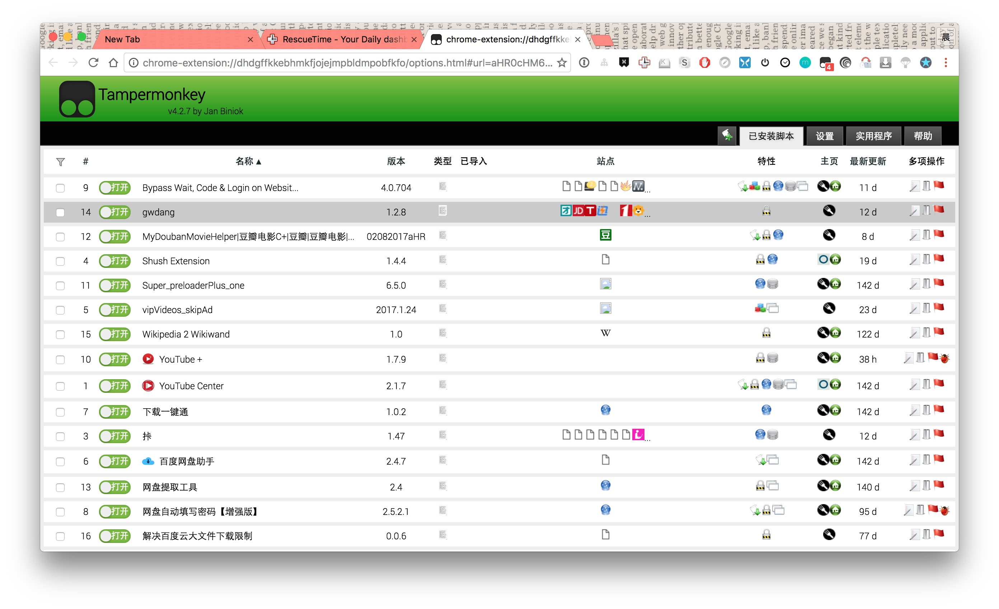

 vpn插件推荐 [Tunnello](https://tunnello.com/)，其他类型的就不列举了，毕竟这类工具属于且用且珍惜型。

 主要是通过这些插件能让浏览器变得更加整洁，浏览网页时能更加美观，能辅助完成一些不必要的操作，达到提高效率的目的。

* **时间管理**

 （[时间都去哪了?用RescueTime和WakaTime来记录你的时间](https://luolei.org/track-your-time/) ）

    [rescuetime](https://www.rescuetime.com/)

    RescueTime是一款著名的跨平台行为追踪时间记录服务，在OSX、PC、浏览器、Android都有应用，基础服务免费，高级附加服务另外收费。

    它可以记录你在电脑上所有的行为，并将这些行为进项分类，通过时间使用分析可以看到自己的工作时间使用情况，可以有针对性的控制自己。

    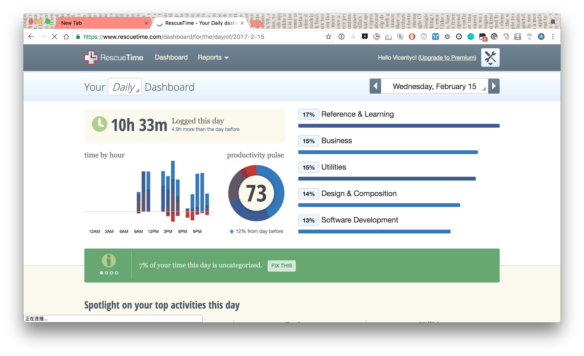

    [wakatime](https://wakatime.com/)

    WakaTime 是一款针对开发者的神器，通过在开发工具上安装这个插件，可以做到精确地统计到你花在某个项目上的时间。和RescueTime一样，基础服务只能查看七天内的时间使用情况。偶尔回去看看自己写代码花了多少时间还是挺有意思的。

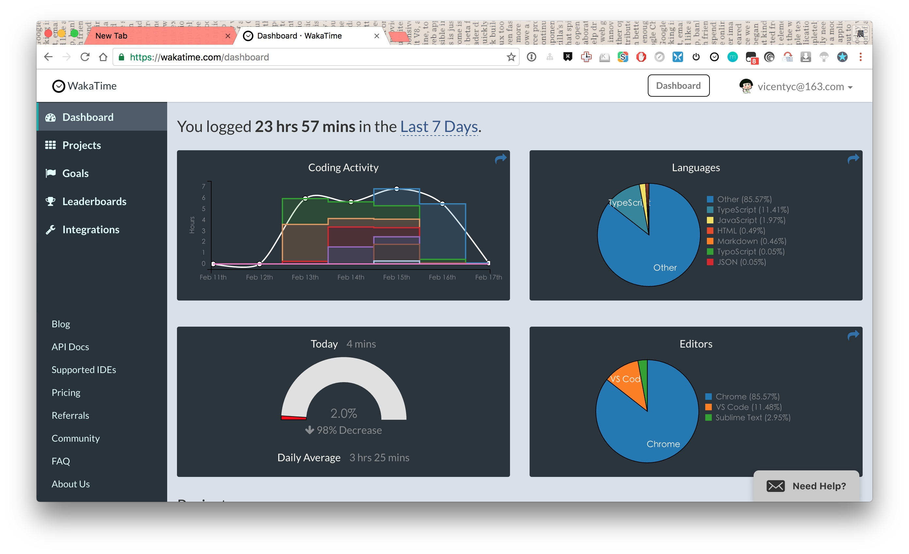

* **保持整洁有序**

 为了不分散自己的注意力，基本不会在电脑桌面存放文件，基本的文件都有对应的归属位置，并及时清理下载文件夹的文件，保持文件夹干净整洁，能够有序查找。

* **app限免**

 app限免信息经常看[appso](http://www.ifanr.com/author/appso)和[appzapp](http://www.appzapp.us/#popFilter:Popular|priceFilter:All|activityFilter:Price)，遇到就是赚到呀。

    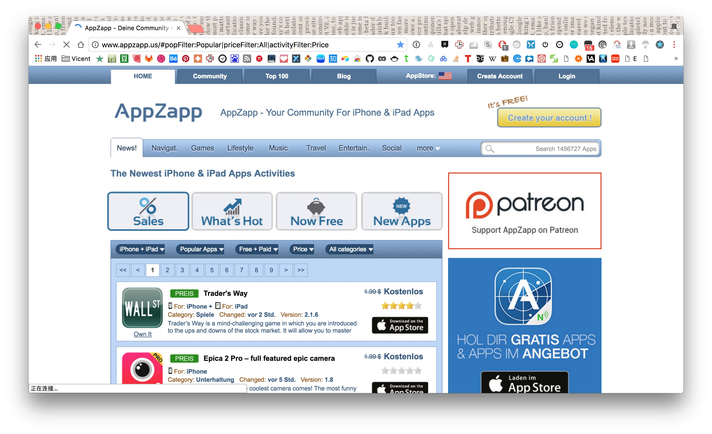

    附上手机桌面一张（尺寸被缩小过）

    

**|结语**

 终于写到了这里，对与于一名程序员来说要完成这样的一篇文章来说真是挺困难的一件事，讲真，这是毕业论文之后写过最长的一篇文章了，在这过程中也暴露那些年学过的语文课都还给老师了。虽然文中有些表达不够有文采，有些感受也不够深入，并且表达逻辑方面还是要多锻炼才是啊。不过也是从有投稿的想法到完成，也算是完成了一篇作业。往后也要更多地把内心想得变成实践做到的。

 整个梳理下来发现涉及的东西也是挺过的，特别是每一项都是经过对比然后留下适合自己的并且运用到自己的工作和生活中，这期间经历了尝试，调整，优化，也耗费了不少的时间和精力，特别是在本身专业技能还有不少需要学习的情况下，但是这样的过程本身也是一种学习，当尝试成功发现确实能够让自己的工作变得更加省心顺心，那这样的付出就是值得的。

 搜寻一些便捷高效的工具时，当你真正发现它正好是你苦苦寻找的那一个的时候，真的有一种相见恨晚的感觉。当然工具最终的目的都是为了解决需求，要提高工作效率，从而提升自身能力。而要说用什么评价自己的技术工作，我想莫过于能用技术手段优化技术工作同时也让生活变得更加高效便捷，整齐有序。深知要学习的还有很多，唯有提高学习能力才能与时俱进，而能够管理好自己又是基础，工具只是其中的辅助。前路漫漫而二十五岁的年纪又偏迷茫多思，希望自己能够沉得住气，脚踏实地，打好基础，努力去争取自己想要的生活。
